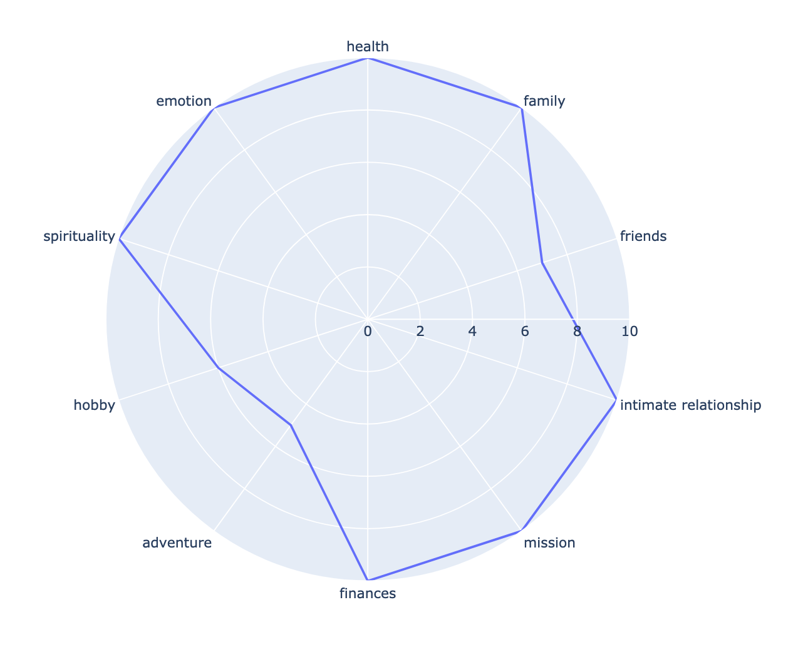

# Best Baseline

It is important to have a well rounded life. Best Baseline helps you keep track of your daily progress, and saves it to painting.csv. No db needed, no app, just your records for you to reflect on.

It also generates a daily plot that can help you take note of where you are today.

If there is an area that you are doing less well than the others, it may be worth investing some time today, or reading a book on that topic to deepend your knowledge.

If you are rocking out at 10 for the day, then see what you can do to do the same tomorrow and set that best as your new baseline.

